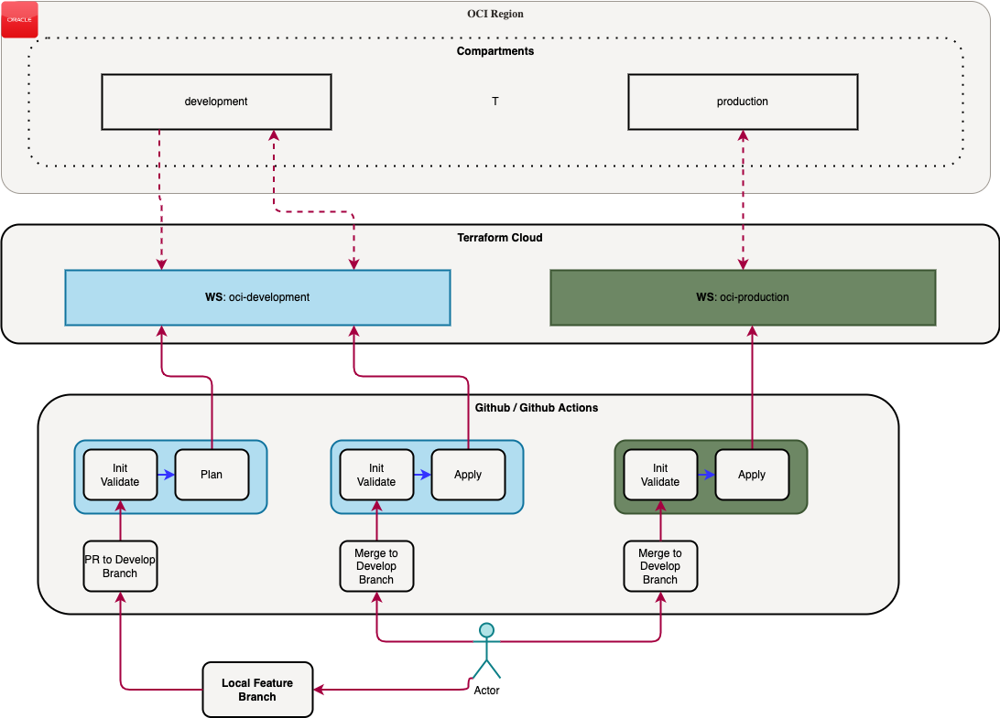

# oci-configuration

Repository contains terraform (TF) scripts to configure my (Oracle Cloud Infrastructure) OCI free tier.

This is also TF learning repository with TF cloud as state file storage.



## Configuration

Currently I'm running TF commands locally while I assume that TF cloud will be used to store state file. To make this work I need to first setup some variables for local testing. Before first execution remove `.sample` from file names in this repository and set variables in `env.sh` and `oci.auto.tfvars`.

## Local Execution

```bash
# tf is an alias for terraform

# Initialize connection to tf cloud.
. ./env.sh

# Initialize tf repository and choose proper workspace.
tf init

# Run tf commands.
tf [command]
```

When using within CI/CD flow (i.e. github actions), variables are set in Terraform Cloud account.
